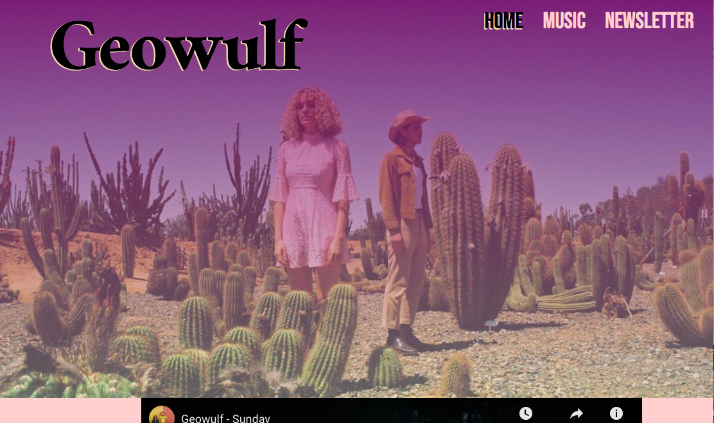
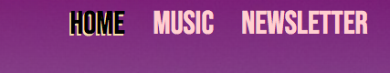
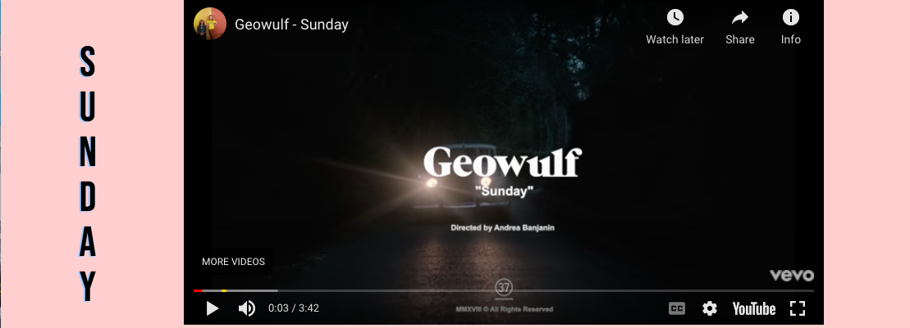
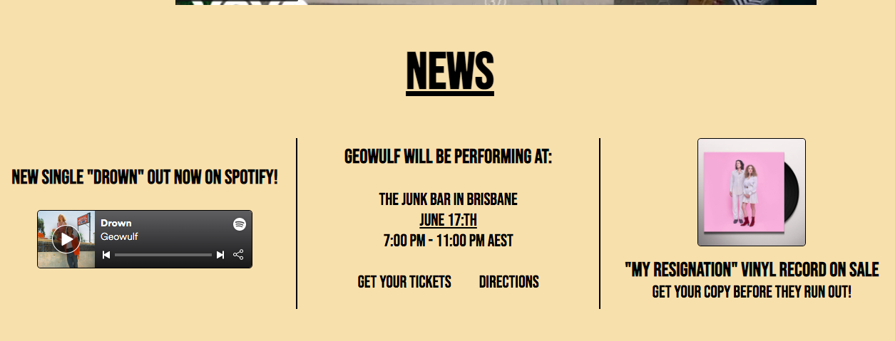
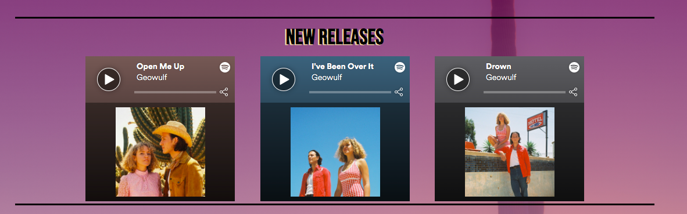
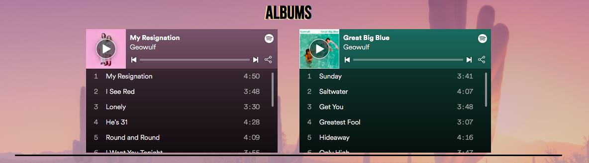
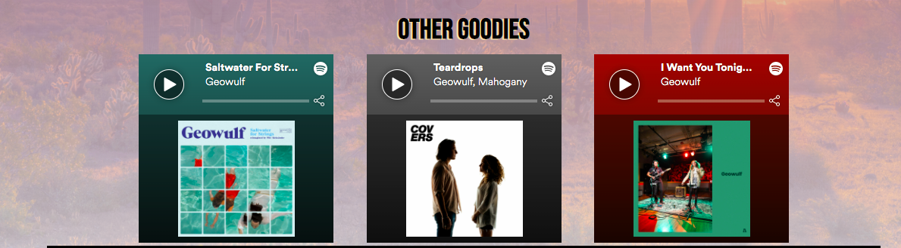
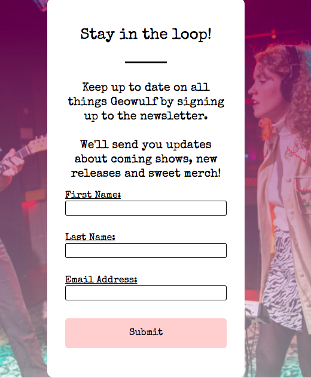

# Official Website for the Band Geowulf

This is the official website for the band Geowulf. It has been designed for fans of Geowulf, and individuals who are relatively unfamiliar with Geowulf and want to explore the band's creative output, and users who want updates regarding the band’s activities. The website has been designed for various screen sizes, from mobile and tablet to larger screen sizes.

## User Experience (UX)
## * User Stories
### * First Time Visitor Goals
- As a First Time Visitor, I want to get a feel for the band and explore the band's creative output.
- As a First Time Visitor, I want to be able to easily navigate the site to find content.
- As a First Time Visitor, I want access to the band’s social media and the band's channels for releasing music and music videos so I can explore the band further.

### * Returning Visitor Goals and Frequent User Goals
- As a Returning or Frequent User, I want to check if there are any updates regarding if the band have any upcoming shows, where they will be performing and how to find my way there.
- As a Returning or Frequent User, I want to check if there are any new releases or music videos available from the band or any new merchandise.
- As a Returning or Frequent User, I want to listen to old releases and watch old music videos from the band.
- As a Returning or Frequent User I might want to sign up for the band’s newsletter to receive updates and information in a more direct and personal way instead of having to seek this information out.

## * Design
### * Colour Scheme
- The main colors used are pink, purple and a beige colour called "wheat" in CSS.
### * Typography
- The font 'Bebas Neue' is the main font used throughout the whole website with 'Sans Serif' as the fallback font in case for any reason the font isn't being imported into the site correctly. 'Bebas Neue' is a font that fits well with the general theme of the website, that is visually attractive and that communicates confidence.
### * Imagery
- For a band website imagery is important. The background hero image is designed to be striking and catch the user's attention. All the images used on the website have been used to create a uniform theme and to give the user a sense of what type of music the band creates and to communicate an atmosphere that matches the atmosphere that the band’s music might inspire.

## Features

* Responsive on all device sizes
* Interactive elements

## Languages Used

* HTML5
* CSS3

## Frameworks, Libraries & Programs Used

1. Hover.css:
* Hover.css was used on the menu items as well as the Social Media icons in the footer.

2. Google Fonts: 
* Google fonts was used to import the fonts 'Ramaraja', 'Bebas Neue' and 'Special Elite' into the style.css file which have been used when creating the website.

3. Font Awesome:
* Font Awesome was used on all pages throughout the website to add icons for aesthetic and UX purposes.

4. Git:
* Git was used for version control by utilizing the Gitpod terminal to commit to Git and Push to GitHub.

5. GitHub:
* GitHub is used to store the projects code after being pushed from Git.

6. Balsamiq:
* Balsamiq was used to create the wireframes during the design process. (The project wireframes files were unfortunately lost during the process.)

## Testing

The W3C Markup Validator and W3C CSS Validator Services were used to validate every page of the project to ensure there were no syntax errors in the project.

* W3C Markup Validator - Results
* W3C CSS Validator - Results
 
## Testing User Stories from User Experience (UX) Section

### * First Time Visitor Goals
I. As a First Time Visitor, I want to get a feel for the band and explore the band's creative output.
A. Upon entering the site users see a large hero image, covering most of the browser screen, that aims to evoke the users’ curiosity. On top of the hero image is an easily readable and attractive navigation menu.
B. The pages have been designed to communicate a specific atmosphere in accordance with the band’s image and musical style.
C. The user could either scroll down the page to watch the music videos that are hinted at at the bottom of the window or could navigate to the other pages on the website via the navigation menu, and explore the band’s discography.

II. As a First Time Visitor, I want to be able to easily be able to navigate throughout the site to find content.
A. The site has been designed to be simple and fluid to use. At the top of each page the user has access to a navigation menu where each link describes what page the user will navigate to by clicking the link.
B. The content on the pages is easy to access and digest and has been kept to a minimum to not overwhelm the user. It has also been structured attractively.

III. As a First Time Visitor I want access to the band’s social media and the band's channels for releasing music and music videos so I can explore the band further.
A. At the bottom of each page the user can navigate to the band's various social media channels and channels for releasing music.

## * Returning Visitor Goals and Frequent User Goals

I. As a Returning or Frequent User, I want to check if there are any updates regarding if the band has any upcoming shows, where they will be performing and how to find my way there.
A. At the bottom of the home page there is a “News” section where users can access information regarding upcoming shows.
B. In the “News” section the user will find links to navigate to relevant websites where tickets for upcoming shows can be purchased as well as directions for users to physically navigate to shows.

II. As a Returning or Frequent User, I want to check if there are any new releases or music videos available from the band or any new merchandise.
A. On the home page there is a “News” section where the band’s newest release is posted. The user can choose to listen to the song on the website or navigate to Spotify.
B. The user can choose to navigate to the “Music” page where more new releases are posted.
C. The music videos on the homepage are intended to be replaced with new music videos periodically so returning users have access to newly released music videos.
D. The footer contains links to the band's Facebook, Twitter, Instagram and Spotify and Youtube channels.
E. Whichever link they click, it will be opened up in a new tab to ensure the user can easily get back to the website.

III. 
A. Users can get access to most of the band's discography by navigating to the ‘Music’ page on the website.
B. Here the music is structured so that it is easy for users to consume.
C. If users want access to all of the band's discography or all of the band's music videos, users can navigate to the band's Spotify or Youtube channels via the footer.

IV. As a Returning or Frequent User, I might want to sign up for the band’s newsletter to receive updates and information in a more direct and personal way without having to seek this information out.
A. Users can navigate to the “Newsletter” page on the band’s website and sign up to the newsletter in a few easy steps.

## Screenshots and Descriptions of Features

This is the hero image that the user first sees when visiting the website. It is a visually pleasing image and is intended to create a certain feeling in the user and inspire curiosity.

This is the menu that appears on every page. This is to allow the user to easily navigate between different pages.

This is one of three embedded music videos on the homepage. The user can easily play and watch these and can choose to enlarge the video so that it covers the entire screen. These elements also work as links to Youtube if the viewer prefers to watch the videos there.

This is the “News” section where the user can find news about the band that might be of interest to the user. Links have been embedded into the appropriate text elements and these pieces of text enlarge when hovered to emphasize that they can be clicked.

This is the footer that appears on all pages of the website. When the icons are clicked the user is taken to the artist’s Facebook page, Instagram page, Twitter, Spotify or Youtube channel respectively. These links open in a new tab.

This is the “New Releases” section on the “Music” page. Here Spotify tracks have been embedded that the user can play on the website if logged into Spotify. If the user is not logged in the user is offered the possibility of logging in to Spotify. The user can also choose to listen to these tracks on Spotify by clicking the Spotify icon on the top right. (Spotify opens in a new tab.)

This is the "Albums" section. Here the user can listen to entire albums from the artist on the website if logged into Spotify. The tracks can be scrolled through. The user can also choose to listen to these tracks on Spotify by clicking the Spotify icon on the top right. (Spotify opens in a new tab.)

This section is for additional tracks that are not included in either of the albums.

This is the form section of the “Newsletter page” where the user can sign up to the newsletter. The user is able to enter information into the form fields and the submit button is clickable.

## Further Testing
* The Website was tested on Google Chrome, Internet Explorer, Microsoft Edge and Safari browsers.
* The website was viewed on a variety of devices such as Desktop, Laptop, iPhone7, iPhone 8 & iPhoneX.
* A large amount of testing was done to ensure that all pages were linking correctly.
* Friends and family members were asked to review the site and documentation to point out any bugs and/or user experience issues.

## Known Bugs

* The website has been difficult to modify to the smallest iphone screen size of 4.7in or 11.938cm. The site appears to work as intended, even for this size, when tested using developer tools in Chrome, but on the actual device some elements appear somewhat differently than intended. On all other mobile and tablet screen sizes the site appears to works as intended however. I am at a loss as to how to fix this issue at the moment and will not have time to figure this out before the submission of the project, but will look into it further if time permits after project submission.

## Deployment

The project was deployed to GitHub Pages.

## Media
* All but one of images used came from the band Geowulf and is their property.
* The image for the background on the "Music" page was downloaded from Shutterstock.
* The songs on the website were created by Geowulf and are the property of Geowulf and their music label 37 Adventures.
* All the music videos on the website were either created by Geowulf or the director Andrea Benjanin.

## Content
* All the content was written by the developer.

## Acknowledgements
* My little brother Philip and my roommate Sofia who were both very helpful with feedback and support.
* My Mentor for helpful feedback.

